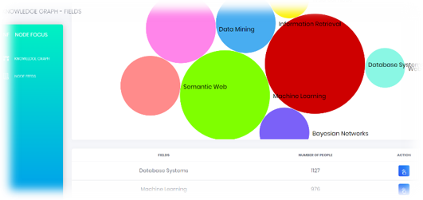
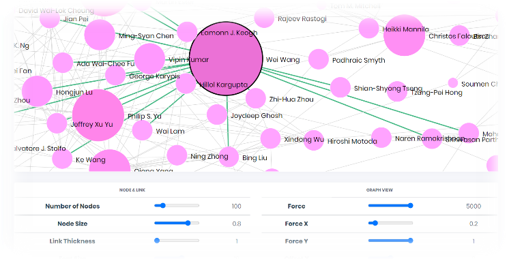
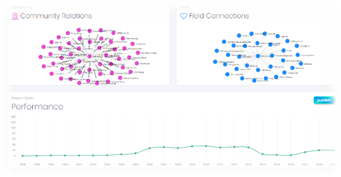
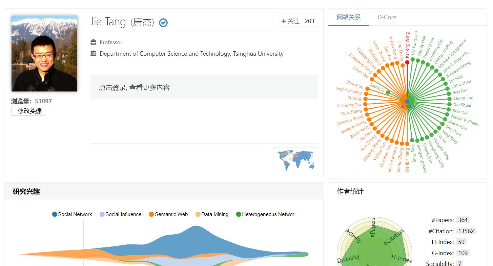
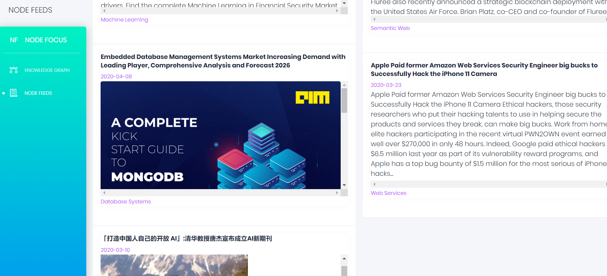

# 
Scholar Linkedin

## **Project Intent**

* **From Individual to the Entire Field**: Current academic websites have vast scholar information but mainly focus on individuals, lacking effective exploration of intrinsic "academic communities" within fields.

* **From Scholar to Scholar Communities**: Users often want to understand not only individual scholars but also closely related collaborators.

* **Solution**: Scholar relationship graph based on domains and influence, with visualization.

* **Audience**: Students, researchers.

## **Project Features**

* Users can visually compare the popularity of different fields.
  
* Quickly understand prominent scholars, compare their influence.
  
* View the academic community of a scholar, including advisors, students, and close collaborators.
  
* Access more detailed information about scholars using Aminer links.
  
* Stay updated with academic news.
  

## **Project Technology**

* Frontend: Vue.js + Bootstrap 4 + D3.js.
* Backend: MongoDB + Flask.

## **Service Status**

* Handles 1067.35 requests per second on average, with an average response time of 93.69ms.
* Total visits exceed 400.

## **Project URL**

http://nodefocus.tech/ (Service expected until April 6, 2021)

## **Challenges and Solutions**

* **Frontend**: Overcame challenges in choosing a knowledge graph library, adapting it to our needs, and efficiently sharing data using Vue.js.

* **Backend**: Faced obstacles with server setup, domain registration, data integration, and nginx configuration. Overcame these by migrating from Heroku to Alibaba Cloud, addressing domain registration delays, and using web scraping to acquire and integrate scholar data.

## **Future Plans**

* Open APIs for data access.
* Full project code open-sourced on GitHub: https://github.com/lllizhenyu/Nodefocus.
* Exploring opportunities for a startup in the scholar-focused market.

Please note that the text provided here is a translation of the original content you shared. If you have any specific questions or need further information, feel free to ask.

## **Reflections**

I believe that SOA (Service-Oriented Architecture) may be one of the most important courses in my college career. It stands out for its freedom, creativity, and its potential real-world application. It has ignited my inner passion and provided a platform for me, someone who seeks practicality, to develop my dreams. This course may not be like others; it doesn't focus on specific content or involve highly specialized knowledge. Instead, it imparts a way of thinking. When faced with complex problems, it teaches how to efficiently address them using advanced technology and innovative approaches. This, I believe, is not just beneficial for this course alone but also a lifelong mindset. Having a goal and efficiently achieving it is one of the key reasons modern society can progress rapidly.
  
## **Thanks**
  
Finally, I want to express my gratitude to the teachers and teaching assistants for their dedication and guidance throughout the semester!
