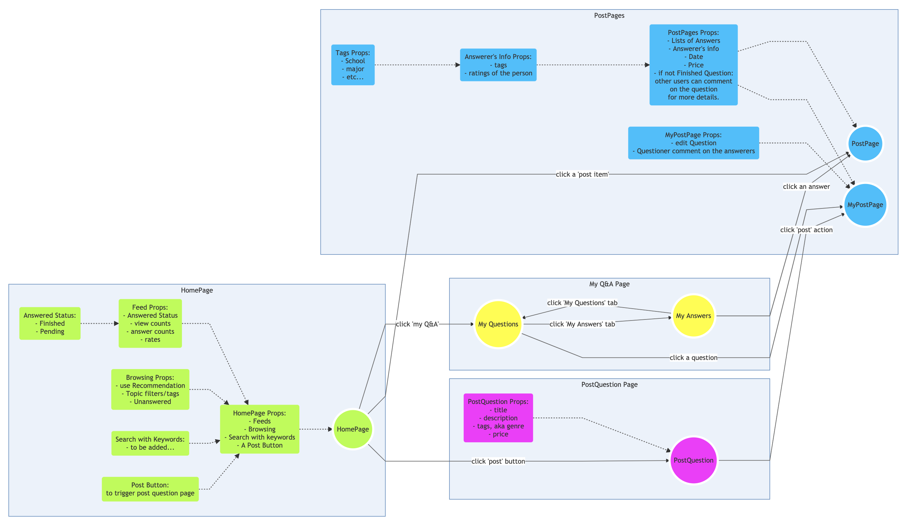

# <center>Progress Report 3</center>

Storms组


# Part One - SOA 课程报告

## 调研总结--负载均衡与动态更新

负载均衡的含义就是将工作任务分摊到多个操作单元上进行，从而加强服务的数据处理能力，增加吞吐量，提高服务的灵活性和可用性。在负载均衡器的基础上，还可以方便地实现系统的动态升级。

我们主要参考了网络博客和相关论文对负载均衡和动态更新进行了调研总结：

## 负载均衡

* 负载均衡分类

  * 软件/硬件负载均衡

    硬件负载均衡是指在服务器和外部网络之间直接安装负载均衡设备，独立于服务器的操作系统。因此整体性能可以达到很高。

    软件负载均衡是借助在服务器上安装软件来实现负载均衡，特点是操作方便，但是软件本身的效率会影响服务器工作的质量。如果软件的可扩展性不好，本身占用的资源很多，那么在连接请求很多的时候反而不好。

    我们这次采用的是`nginx`作为负载均衡代理，它具有轻量、低耗的特点，可以应对一般的负载均衡场景。

  * 本地/全局负载均衡

    从地理位置上来看，负载均衡可以分为本地负载均衡和全局负载均衡，本地负载均衡主要解决本地服务器流量过大，负荷过重的问题。全局负载均衡主要解决服务器分布在多地的情况下解决网络拥塞，提高用户访问速度的问题。

* 负载均衡的常见技术

  * 基于`DNS`的负载均衡

    `DNS`服务器中，可以为多个不同的地址配置相同的名字，因此可以用随机解析域名和IP的方式来实现负载均衡

  * 反向代理负载均衡

    我们采用的就是用`nginx`实现反向代理负载均衡，用户们可以通过反向代理访问内部Web服务器。

  * 基于`NAT`的负载均衡技术

    通过一个地址转换网关将每个外部连接均匀转换为不同的内部服务器地址的方式实现负载均衡。

* 负载均衡的算法

  假设我们有多个节点可以提供相同类型的服务，如何做到负载均衡呢？常用算法有很多，我们这里只总结一些比较典型的方式，并分析了它们各自的优劣势。

  * 轮询算法（`round-robin`）和随机算法（`random`）

    这是最简单的两种算法，即对每个节点进行轮询分配或者随机分配，按照概率来讲所有节点以相同的概率提供服务。

    优点是实现简单，在要求不高的情况下可以使用。

    缺点是没有考虑节点之间的差异，同样的请求数量，低配的机器可能已经满负荷，高配的机器也许还比较轻松。

  * 加权轮询算法（`weighted round-robin`）和加权随机算法（`weighted random`）

    该算法针对以上两种算法的缺点进行了进一步改进，也就是考虑了不同节点在提供服务方面的性能差异，从而给予不同的权重，实现“能者多劳”。这样设备可以实现更高的了利用率。

    但需要注意的是在确定不同节点的权重的时候需要考虑请求的类型，如果是计算密集型，就需要考虑`CPU`、内存，如果是`IO`密集型，需要考虑磁盘性能。

  * 哈希（`hash`）与一致性哈希

    该算法从另外一个角度出发，将客户端的IP或者请求的KEY进行哈希，然后对节点数取模。

    这样做有一个突出的优点是同一个请求可以分配到同一个节点，这在某些需要具有“连续性”的服务场景下很必要；另外哈希也在一定程度上保证了均衡。

    当然上述做法仍然存在一定缺陷，比如当节点数目变化的时候，如何解决会话保持问题？一致性哈希算法中引入了数目不变的虚拟节点，哈希的时候使用虚拟节点数目，同时虚拟节点与五里界店直接有映射关系。物理节点变化的时候，虚拟节点的数目无需变化，只涉及到虚拟节点的重新分配，只相当于物理节点的权重发生了变化。

  * 最少连接算法

    以上算法有一个共同的特点是没有考虑实时的节点负载情况，不易对复杂情况做出灵活的反应。而最少连接算法是指当请求到来时，会选取当前连接数最少的一台服务器来处理请求。

    当然，连接数最少只是一种考虑维度，实际上我们可以基于不同的参数，找到适合不同场景的更均衡的动态分配算法。

  以上几种算法也可以分为静态和动态算法，静态指的是不考虑服务器的实时状态，根据既定的模式分配任务，比如（加权）轮询算法、（加权）随机算法、（一致性）哈希算法，动态指的是根据实时负载状态信息来决定任务的分配，比如上文的最少连接算法。

  考虑到我们服务的实际场景，在服务量还不大的情况下，使用两个服务节点同时提供服务。采用的负载均衡算法是加权轮询算法。

## 动态更新

在负载均衡器的基础上，除了正常的负载均衡之外，我们还可以实现动态更新。

我们也调研了一些基本的单服务器组的服务更新（发布）方式，总结如下：

* 蛮力发布

  顾名思义，蛮力更新也就是在需要更新服务的时候先中断旧版本，再上线新版本。

  虽然这样做成本低，但是用户体验不好，出了问题回退也慢。

* 金丝雀发布

  以前旷工开矿下矿洞前，先会放一只金丝雀进去探是否有有毒气体，看金丝雀能否活下来。金丝雀发布类似于此，会先更新小比例的服务器用作流量验证，然后根据实际测试的情况决定回退或是将剩下的全部更新。这样做对于用户造成的影响较小。

* 滚动发布

  滚动发布在金丝雀发布基础上的进一步优化改进，是一种自动化程度较高的发布方式。一次滚动式发布一般由若干个发布批次组成，每批的数量一般是可以配置。

  这种方式用户的体验较为平滑，不过需要较复杂的发布工具。

基于以上调研，我们决定采用金丝雀发布的方式来进行动态更新。


*参考资料*：

*[1]刘维.负载均衡技术在电子商务网站中的应用研究[D].湖南:湖南大学,2018.*

*[2]俞楼涛.几种常见的负载均衡算法的优化[J].电子制作,2017,(20):45-46.*

*[3]刘立斌.基于负载均衡技术的研究及展望[J].市场周刊,2017,(10):140-142.*

*[4]https://www.cnblogs.com/xybaby/p/7867735.html*

*[5]https://www.cnblogs.com/apanly/p/8784096.html*

## 负载均衡实现

我们在项目中采取了加权轮询的方式，该算法的原理见上文介绍。

具体来讲，我们运行了两个服务节点（前端+后端），连接同一个`mongo`数据库。前端分别服务于`8080`端口和`8081`端口，每个节点的轮询权重分别为`2`和`1`，也即访问第一个服务的概率为第二个服务的两倍。

实现上来说，我们在`80`端口运行了`nginx`代理，然后在`nginx`的配置文件中修改如下：

```c++
upstream nodefocus{
server 123.56.73.194:8080 weight=2;
server 123.56.73.194:8081 weight=1;
}
  #limit_zone crawler $binary_remote_addr 10m;
 #下面是server虚拟主机的配置
 server
  {
    listen 80;#监听端口
    server_name localhost;#域名
      location /
    {
     proxy_pass http://nodefocus;
     proxy_set_header Host $host;
     proxy_set_header X-Real-IP $remote_addr;
     proxy_set_header REMOTE-HOST $remote_addr;
     proxy_set_header X-Forwarded-For $proxy_add_x_forwarded_for;
    }
    access_log off;
  }
}  
```

需要注意的是要设置将用户的请求也转发到服务节点，否则后端看到的将是`nginx`的请求信息。

观察日志后发现，两个服务节点的处理请求数量基本符合设置的权重。

## 压力测试

* 测试环境：

  * 型号：`Alibaba Cloud ECS`
  * `CPU`：`Intel(R) Xeon(R) CPU E5-2682 v4 @ 2.50GHz`
  * 内存：`   Size: 4096 MB`
  * 操作系统：`Ubuntu 18.04.4 LTS`
  * `nginx`版本：`nginx/1.6.2`
  * 测试工具：`This is ApacheBench, Version 2.3 <$Revision: 1807734 $>`

* 测试过程：

  我们使用了`ab`（`ApacheBench`）测试工具对`Web`应用进行了并发测试。测试了`100`并发，处理`5000`请求下的结果：

  * 直接对`flask`后端数据接口`http://123.56.73.194:3389/fields`压力测试

    ```
    ab -c 100 -n 5000 -k http://123.56.73.194:3389/fields
    This is ApacheBench, Version 2.3 <$Revision: 1807734 $>
    Copyright 1996 Adam Twiss, Zeus Technology Ltd, http://www.zeustech.net/
    Licensed to The Apache Software Foundation, http://www.apache.org/
    
    Benchmarking 123.56.73.194 (be patient)
    Completed 500 requests
    Completed 1000 requests
    Completed 1500 requests
    Completed 2000 requests
    Completed 2500 requests
    Completed 3000 requests
    Completed 3500 requests
    Completed 4000 requests
    Completed 4500 requests
    Completed 5000 requests
    Finished 5000 requests
    
    
    Server Software:        
    Server Hostname:        123.56.73.194
    Server Port:            3389
    
    Document Path:          /
    Document Length:        232 bytes
    
    Concurrency Level:      100
    Time taken for tests:   4.685 seconds
    Complete requests:      5000
    Failed requests:        0
    Non-2xx responses:      5000
    Keep-Alive requests:    5000
    Total transferred:      1900000 bytes
    HTML transferred:       1160000 bytes
    Requests per second:    1067.35 [#/sec] (mean)
    Time per request:       93.690 [ms] (mean)
    Time per request:       0.937 [ms] (mean, across all concurrent requests)
    Transfer rate:          396.09 [Kbytes/sec] received
    
    Connection Times (ms)
                  min  mean[+/-sd] median   max
    Connect:        0    0   0.8      0       7
    Processing:     3   89  63.7     76    1208
    Waiting:        1   44  55.7     35     928
    Total:          9   89  63.6     80    1208
    
    Percentage of the requests served within a certain time (ms)
      50%     80
      66%     95
      75%    104
      80%    108
      90%    120
      95%    242
      98%    284
      99%    320
     100%   1208 (longest request)
    ```

    可见平均每秒可以处理的请求数量为`1067.35`，每个请求平均用时为`93.690ms`，有`95%`的

    请求在`242ms`内完成。

  * 对前端`http://123.56.73.194:8080`进行压力测试

    ```
    ...
    equests per second:    447.36 [#/sec] (mean)
    Time per request:       223.533 [ms] (mean)
    Time per request:       2.235 [ms] (mean, across all concurrent requests)
    Percentage of the requests served within a certain time (ms)
     95%    775
    ...
    ```

    平均每秒可以处理的请求数量为`447.36`，每个请求平均用时为`223.533ms`，有`95%`的

    请求在`775ms`内完成。

    通过前端访问数据相比于直接访问后端，延迟大约翻倍，吞吐率也约减小为1/2。

* 总结

  我们的`Web`服务对于中小规模的用户量还是可以比较好地应对，但是要应对大规模的访问肯定是承受不了的，需要做进一步优化。

  实验中发现加了`nginx`代理之后吞吐率反而下降了，可能是配置上仍然问题，需要进一步探索。

  *参考资料：*

  *https://www.cnblogs.com/kazihuo/p/7986681.html*

  ## 动态更新

  采用了金丝雀发布的方式，将在展示时演示实现过程。

  *参考资料：*

  *https://blog.csdn.net/liumiaocn/article/details/80572672*

  


# Part Two - 学脉报告

## Storms这周主要的工作有：

1. 公司定位
2. 开发产品
3. 之后的迭代计划
4. xlab

--------

#### *以下将具体解释：*

1. 公司定位：

我们产品的核心功能是关系网和匿名讨论，在选择什么来先开发上我们进行了深入的调研以及探讨。

关系网：
我们认为关系网的商业可行性非常多，但我们还无法在这万千优势中选出一个现在可行的发展方案，还需要做更多的市场调研以及产品策划。

匿名功能：
与此相比匿名功能，它实现起来相对关系网要简单，而且问卷调研的结果也表明现阶段学生有非常大的匿名平台需求。
所以我们决定先实现匿名讨论功能，针对用户是学生为主的学者，在这个平台上学生可以通过有偿提问的方式，筛选有一定学术背景的匿名用户来回答自己的问题。这种方式不仅能够有效控制答案的质量，同时还提供了平台的激励机制。


2. 开发产品
我们都已经学习了react native框架，我们的技术选型是react native + ignite + bowser + typescript。已经实现了login页面和发表问题页面。
预计会在下周实现剩下的匿名功能的demo，目前希望能在**第16周SOA课展示的时候展示我们的匿名demo**



3. 之后的迭代计划
将在期末考试结束之后开始关系网的定位以及开发，预计2-3个星期实现。
匿名平台的用户测试也将在期末考试结束之后开始进行。

4. xlab
下周五下午跟xlab有个新项目见面会，那之后会积极跟xlab一起准备公司注册的相关业务。