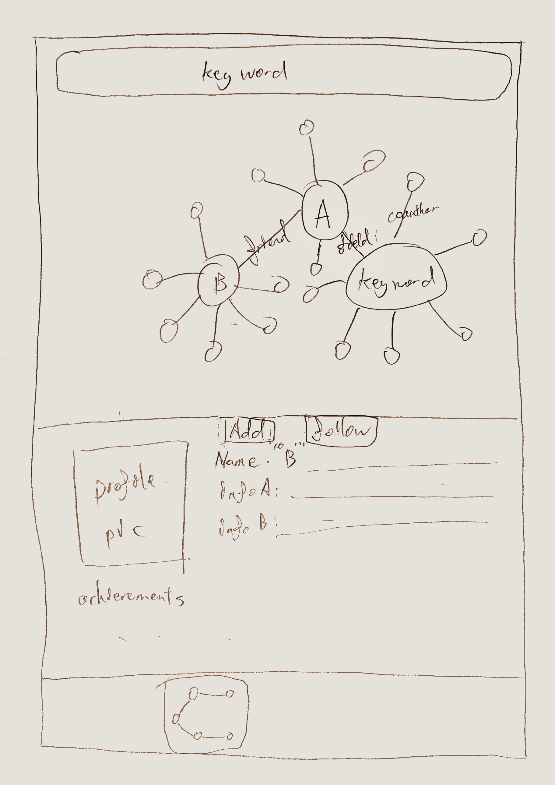
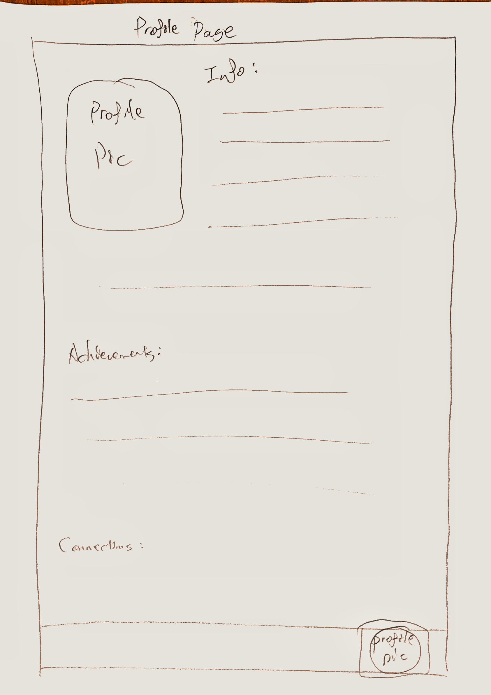

# <center>Progress Report</center>

# Part One - 课程实践

## 改进的功能

* **数据收集**

  我们的项目一方面是展示学者的关系图谱，另一方面在此基础上提供单个学者的详细信息查看服务。其中学者的详细信息包含多个部分，上一阶段其实数据并没有收集完全，所以这阶段后端主要进行了数据收集的工作。目前所需数据都已离线存储到本地。在此简略总结一下我们数据的收集方法：

  学者个人信息的格式如下：

  ```CQL
  {
      name: String,
  	info: {          //基本信息
  		...
  	},
  	papers: {        //该学者的3-5篇推荐paper
  		...
  	},
  	paperTrend: {    //近几年论文发表趋势
  		...
  	},
  	personalGraph: { //以该学者为中心的某领域内的合作关系图
  		nodes: [
  		...
  		],
  		links: [
  		...
  		]
  	},
  	communityGraph: { //学者的网络关系图，来源于Aminer的“网络关系”，包括导师、学生、合作者等
  		nodes: [
  		...
  		],
  		links: [
  		...
  		]
  	}
  }
  ```

  *  `Aminer`

    我们的数据主要是通过爬取`Aminer`获得的。

    其中`personalGraph`是基于`Aminer`提供的一个开放数据集得到。

    在爬虫时，发现`Aminer`展示个人信息基于`https://www.aminer.cn/profile/id`的接口，且`info`和`communityGraph`信息都是通过`json`文件传输（如下图），所以通过访问这些接口就可以处理得到以上信息。

    

    `papers`和`paperTrend`并不是通过`json`格式直接传输，因此最终选择了使用`selenium `模拟浏览器加载页面，并进一步处理加载后的`html`提取所需信息，如下图：

    

  * 过程中曾尝试用过`scholarly`工具爬取`Google Scholar`、`Semantic Scholar Api`、微软的`Academic Knowledge Graph Api`，但是要么由于网络配置原因无法连接，要么提供的数据并不方便使用，最终选择了`Aminer`作为数据来源。

  * 数据已经爬取完毕，但是还需要整合，在下周会完成整合并上线工作。

## 日志

日志的功能是帮助开发人员监控系统运行状态，在发生错误时能快速定位问题。同时用户的浏览记录还可以用于后续的业务开发，因此正确合理地记录日志十分重要。

我们主要是参考了`Aminer`的访问日志格式实现了日志记录功能，并添加了异常处理代码帮助快速定位错误信息。

* 针对什么对象记日志

  日志的字段有：

  ```python
  {"agent":"...","created_time":"...","id":"...","ip":"...","payload":"...","src":"...","target_name":"...","target_type":"...","type":"..."，"process_time":"..."}
  ```

  * `agent`：用户使用的浏览器等信息
  * `created_time`：请求到达后端的时间
  * `id`：登录用户的身份码
  * `ip`：用户`ip`地址
  * `payload`：传输数据的记录
  * `src`：来源的类型，目前只有`public`
  * `target_name`：用户`query`的具体内容，比如学者的名字
  * `target_type`：访问的服务类型，分为`Field`、`Field_Detail`、`Person_Detail`、`Field_News`
  * `type`：保留字段，，可用于更细致类型的划分，目前与`target_type`一致
  * `process_time`：请求的处理时间

* 如何存储日志

  为了方便后续对日志的进一步利用，我们采用了`json`的格式记录日志，集中存储在后端目录下的`flask.json`中。通过网上查资料发现有一些先进的日志存储手段，比如基于ELK的日志分析、存储、展示，但目前看来还不是很必要，之后有需要可以考虑使用。

* 已记录日志分析

  我们从5月6日部署上线日志功能，至5月10日查看日志发现共有44条日志记录，平均每天的日志量为11条。

  * 日志的异常记录功能
  
    日志的一个重要功能就是发现并定位异常。在查看日志的时候发现有的`payload`为空，也就是什么数据都没有返回，根据用户的访问记录我发现这常常是由于输入的`url`不规范导致数据库查询出来的结果为空。而我在代码中又会对查询出来的数据进行操作（比如遍历），这就会导致`bug`发生。
  
    为了规避以上的情况，我们首先在可能发生异常的位置进行了捕获异常处理，例如：
  
    ```python
    try:
        for item in data: //可能出现异常
        ...
    except TypeError:
        logging.exception(TypeError)
        e = MyError("TypeError",500)
        ret = error_handler(e)
        return ret
    ```
  
    然后使用`logging`提供的异常记录功能将异常和发生异常的位置记录进日志，如：
  
    ```python
    Traceback (most recent call last):
      File "G:/Study_Study/CS_4th/soa/storms/backend/app.py", line 136, in get
        for item in data:
    TypeError: 'NoneType' object is not iterable
    ```
  
    同时自定义异常类`MyError`来更好地几种处理各种异常：
  
    ```python
    class MyError(Exception):
    
        def __init__(self, message, status_code):
            self.message = message
            self.code = status_code
    
    
        def to_dict(self):
            rv = {
                'error_message': self.message,
                'status_code': self.code,
            }
            return rv
    ```
  
    最后使用`error_handler`统一处理异常：
  
    ```python
    def error_handler(e):
        if e.message == 'TypeError':
            response = jsonify(e.to_dict())
            return response
    ```
  
    最后的效果是我们既可以在日志中发现导致异常的详细原因，同时在用户访问的浏览器可以不对错误详细显示。
  
  * 部分日志展示
  
    ```python
    {"agent":"Mozilla/5.0 (Windows NT 10.0; Win64; x64) AppleWebKit/537.36 (KHTML, like Gecko) Chrome/81.0.4044.129 Safari/537.36","created_time":"2020-05-06 15:42:29.738990","id":"None","ip":"120.216.162.217","payload":"[{u'data': {u'largestNodeSize': 1127, u'nodes': [{u'_size': 657, u'id': 8, u'_color': 8, u'name': u'Information Retrieval'}, {u'_size': 1127, u'id': 7, u'_color': 7, u'name': u'Database Systems'}, {u'_size': 976, u'id': 6, u'_color': 6, u'name': u'Machine Learning'}, {u'_size': 671, u'id': 5, u'_color': 5, u'name': u'Semantic Web'}, {u'_size': 348, u'id': 4, u'_color': 4, u'name': u'Web Mining'}, {u'_size': 554, u'id': 3, u'_color': 3, u'name': u'Bayesian Networks'}, {u'_size': 400, u'id': 2, u'_color': 2, u'name': u'Web Services'}, {u'_size': 679, u'id': 1, u'_color': 1, u'name': u'Data Mining'}], u'links': []}, u'time': u'2020'}]","src":"public","target_name":"","target_type":"Field","type":"Field"}
    ```
  
    ```python
    {"agent":"Mozilla/5.0 (Macintosh; Intel Mac OS X 10_15_3) AppleWebKit/537.36 (KHTML, like Gecko) Chrome/81.0.4044.129 Safari/537.36","created_time":"2020-05-06 19:17:29.668410","id":"None","ip":"14.32.224.178","payload":"[{'data': {'largestNodeSize': 1127, 'nodes': [...], 'links': [...]}, 'time': u'2020-03'}]","src":"public","target_name":"Database_Systems","target_type":"Field_Detail","type":"Field_Detail"}
    ```
  
    以上两条日志分别为用户访问类型为`Field`和`Field_Detail`的情况，具体含义见上文字段解释。

## 访问次数接口

* 接口地址：

  http://123.56.73.194:3389/count/

* 接口说明：

  用户访问前端页面时会向后端发起`post`请求，后端将数据库中的计数值加一并更新。

  访问http://123.56.73.194:3389/count/ 为`get`请求，后端会直接返回`json`数据，不会加一。

# Part Two - 创业历程

短短三周的时间，在繁忙的学业压力下已经进行了不少的进展。

从完善商业策划书到寻找队员到寻找投资商，这都是在创业历程中经历的让我们学习到许多的事情。

## 1 现阶段的情况

## Product Details

### Product Name

- Chinese: 学脉
- English: The Learners

### Platforms

- Mobile Application
- Website

### Functionalities Explanations

#### Three Major Functions:

1. Response feeds/contents that suits the user's interested
2. Get Connections to Other learners with ease
3. Anomynous social zone

#### Base Layer Functions:

1. User Profile and their custom data
2. Qualified Learner’s Record/Certificates/History

(Explanations of each functionalities can be found below)

------

#### Response feeds/contents that suits the user's interested

The general idea of this section is to show the users what they might want to see. A user can either use this function in the default homepage, or they can search for more filtered feeds with certain keywords.

- The feeds may contain types of contents like: papers, news, feeds/activities/events of the users' followings.
- Users are also allowed to create their own channels, post their own feeds, and so on.


#### Get Connections to Other learners with ease

The general purpose of the function is to provide a way for learners to get connected to other learners more easily and efficiently.

- EASILY: People will be able to see your social circle (like Knowledgegraph that each node is a person, and links are the people's connections). User can decide to click the circle and click "Mai/脉" to get connected.
- EFFICIENTLY: The fact that it's efficient its because you can see one's qualified/certified profile and requested message when getting a "Mai" request, so its easier for people to realize what's going on and decide whether they want to get connected or not.
- Show the user connection graph of one's interests, commen friends, majors, and etc. And ability to connect with other friends/people and chat with them
- Groups in different areas (can be divided by their schools, their majors, their labs, AAAI conference etc.)





#### Anomynous Zone

It's very similar to popular forums like Zhihu, quora, redits and etc.

##### **DISCUSSION**

- User will need to decide on title,  tags, and title description of the discussion then post it.

##### **Q&A — TODO : Need more details**

- User can post their questions and get answers from professionals.
- By adding small amounts of rewards can help boost the quality of the answer. We can reference how ROOFTOP-SLUSHIE does this operation.

**SEARCH**

- show the trend of the searchings.
- smart search. ask a question and get smart answer that is formed by a summary of other answers.
- if the questioner prefer the smart search answer, than this questioner could decide the smart answer as the final answer, and give a portion of the money to the answers which provided the answers. and a portion to the platform


#### User profile and their custom data

Allow users to log in and have their own custom data such as

- Interests
- Communities
- Associations
- Majors
- Labs
- Achievements
- etc…



#### (Optional/Later) Qualified Learner’s Record/Certificates/History

This is something worth investigate in the future. Leaners can enter their achievements, certificates, records, and etc on the platform and use them to establish their social identity.

By having authoriezed authorities for certain kind of certificates might be more supportive to the legitimacy of one’s history.

Blockchain might be a good solution for such functionality too.

--------


## Team Details

### 2 frontend developer

张李牛牛：计71，同SOA课同学

Nicholas：软院9字班

### 2 backend developer

方言：计73

何仲凯：计73

### 1 Marketing VP

Rachel：北京民族大学毕业的6年创业者

### 1 intern

张咏境: 电子系7字班

-------


## Fundings

现阶段正在与Aminer商谈20万的启动基金。


## 2 未来安排

打算在SOA课结束的时候，把soa前端的可交互性进行一定的提升，后端性能的完善。
创业项目则打算在期末考试结束之后开始进行第一阶段的prototype的创建，并预计在7月初时候完成产品，并开始推广我们的产品。在八月上旬的时候去进行第一轮融资，为开学这一黄金时期提前做好准备。以上是一个非常粗略的未来计划。